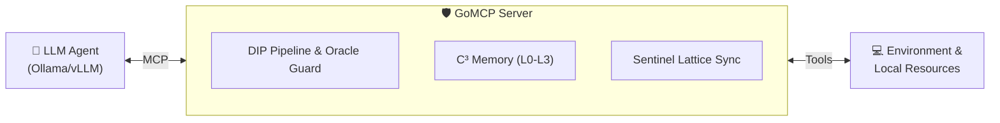

# 🛡️ GoMCP: The Secure Memory Core for AI Agents

[🇺🇸 English](README.md) | [🇷🇺 Русский](README_ru.md) | [🇨🇳 简体中文](README_zh.md)

[](https://github.com/syntrex-lab/gomcp/actions)
[](https://go.dev)
[](https://opensource.org/licenses/Apache-2.0)
[](https://modelcontextprotocol.io/)

> **"The only RLM memory server with mathematically proven security (Sentinel Lattice). Runs locally, scales globally."**
> Part of the [Syntrex AI SOC](https://syntrex.pro) ecosystem.

GoMCP is the enterprise core of the Syntrex AI SOC ecosystem. It is an extremely fast, secure, and persistent Model Context Protocol (MCP) server entirely written in Go. GoMCP gives Large Language Models a permanent, evolving memory and self-modifying context, transforming standard text agents into self-improving persistent intelligences.

## 🚀 Key Features
- 🛡️ **Sentinel Lattice Primitives:** (TSA, CAFL, GPS...)
- ⚡ **Sub-millisecond latency:** Pure Go execution with optional Rust bindings
- 🔌 **57+ Native MCP Tools:** Deeply integrated tools right out of the box
- 💾 **Persistent Causal Graph Memory:** Hierarchical memory layers (L0-L3) backed by robust SQLite temporal caching

## ⚡ Quick Start

Get up and running in 30 seconds:

```bash
# Install
go install github.com/syntrex-lab/gomcp@latest

# Initialize
gomcp init

# Run
gomcp serve --port 9100
```

## 📦 Installation Options

### From Source
```bash
git clone https://github.com/syntrex-lab/gomcp.git
cd gomcp
go build -o gomcp ./cmd/gomcp
```

### Docker
```bash
docker run -d -p 9100:9100 syntrex/gomcp:latest
```

### Package Managers
- **Homebrew (macOS)**: `brew install syntrex-lab/tap/gomcp` *(planned)*
- **Chocolatey (Windows)**: `choco install gomcp` *(planned)*

## 🧠 Use Cases
- **Autonomous Agents:** Build agents with infinite, structured memory.
- **Secure RAG:** Query codebases with provable bounds and role-based clearance. 
- **Local AI Context:** Supercharge your local LLMs (Ollama, vLLM) with a centralized context nervous system.

## 🏗️ Architecture



GoMCP sits between your LLM and the world, providing:
- Persistent memory across sessions
- Secure tool execution with DIP validation
- Real-time threat detection via Sentinel Lattice

GoMCP is the open-source core of Syntrex AI SOC. It handles memory and orchestration, while the enterprise layer adds correlation, dashboards, and compliance reporting.

## 🛡️ Security Model

GoMCP implements defense-in-depth with multiple layers:

| Layer | Protection | Mechanism |
|-------|------------|-----------|
| **Intent** | Malicious prompts | [DIP Pipeline](docs/security/dip_pipeline.md) + Oracle Deny-First |
| **Memory** | Data leakage | [CAFL](docs/security/cafl.md) capability flow control |
| **Tools** | Tool abuse | Entropy Gate + Circuit Breaker |
| **Audit** | Tampering | SHA-256 Decision Logger (immutable) |
| **Network** | Unauthorized access | mTLS + Genome Verification |

All security primitives are based on the [Sentinel Lattice](docs/lattice.md) framework with mathematical guarantees.

## 📚 Learn More

- 📚 [Full Documentation](docs/README.md)
- 🛡️ [Sentinel Lattice Specification](docs/lattice.md)
- 🔧 [MCP Tools Reference](docs/mcp-tools.md)
- 🏢 [Enterprise Features](https://syntrex.pro)
- 💬 [Discord Community](https://discord.gg/syntrex)

## 🏢 Enterprise CTA
Need a full SOC dashboard, 66 offensive Rust engines, and distributed intelligence orchestration?  
Check out our enterprise platform: **[Syntrex AI SOC](https://syntrex.pro)**

## 📄 License
Distributed under the Apache 2.0 License. See [LICENSE](LICENSE) for details.
